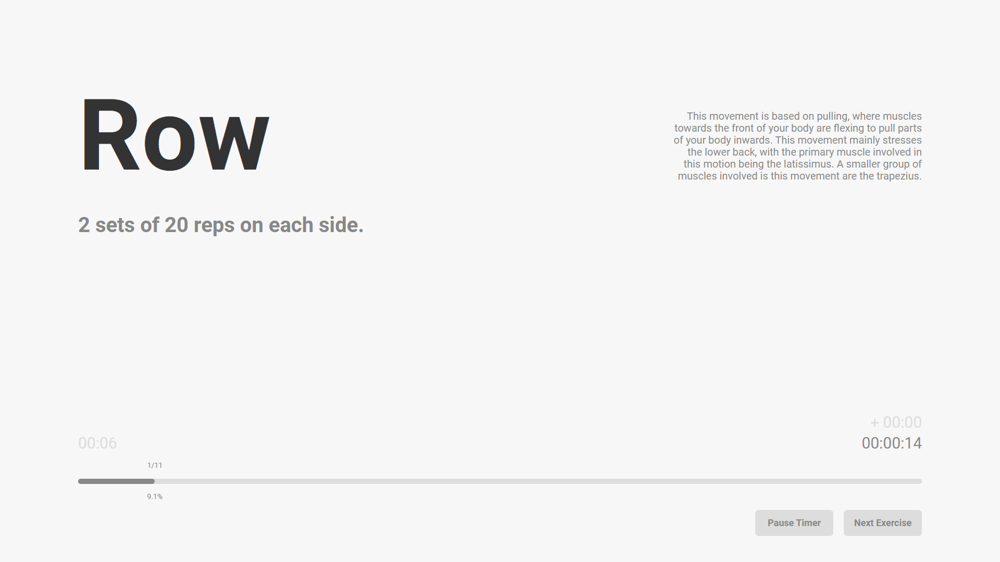
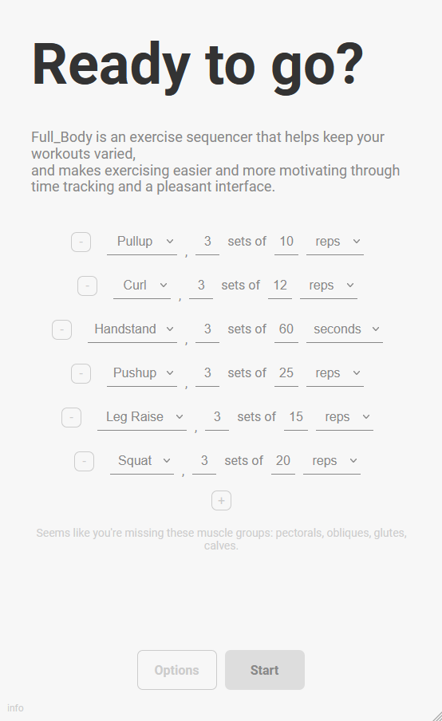

# full_body

_full\_body_ is an exercise sequencer. This simple web application is meant to provide a more varied way of performing a workout. By providing it with a list of exercises, it will generate a unique sequence of exercises each time, making each workout less monotonous!

Not only that, but _full\_body_ helps you stay motivated with a progress tracker and pretty interface.

In addition, _full\_body_ includes various clocks for timing the total session time, amount of time taking breaks, and a countdown timer with audio feedback for timed exercises like planks.

And of course, it works on mobile.

Additional documentation can be found on [my site](https://v-os.ca/full_body).

## How To Use

_full\_body_ is run entirely on the web, on [v-os](https://exp.v-os.ca/full_body).

## Disclaimers

- This application **uses cookies to save your workout plan**, and therefore may lose your data in the event you clear your cookies.

- This application is a fun way to add some variety to one's workout, but it is **not a substitue for professionally offered advice**, and does not claim to be more efficient or performative than any other workout approach.

## To Do

- Add preset workouts.