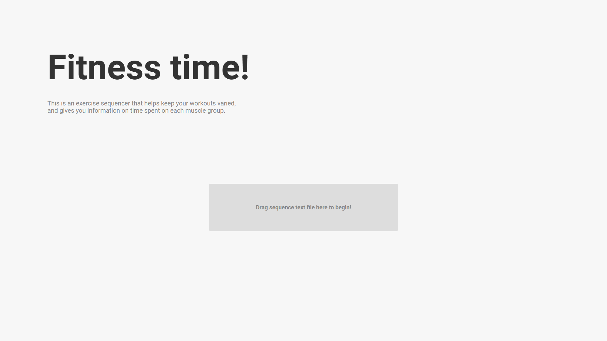

# full_body

_full\_body_ is an exercise sequencer. This simple web application is meant to provide a more varied way of performing a workout. By providing it with a list of exercises, it will generate a unique sequence of exercises each time, making each workout less monotonous!

Not only that, but _full\_body_ helps you stay motivated with a progress tracker, and lots of flavor text to keep you engaged. Each exercise also has text associated with it that describes the exercise and keeps you focused and mindful of your form.

In addition, _full\_body_ includes various clocks for timing the total session time, amount of time taking breaks, and a countdown timer with audio feedback for timed exercises like planks.

Note: this application is made **exclusively for desktop**.

Additional documentation can be found on [my site](https://v-os.ca/full_body).

## How To Use

_full\_body_ is run entirely on the web, on [v-os](https://exp.v-os.ca/full_body).

For _full\_body_ to understand what sequence of movements you'd like to do, you must create a `.txt` file which includes those movements and upload it to the site. No need for a profile, no need to re-enter your workout plan each time, and no need for me to spend time programming a database.

An example `.txt` file is found in the root folder, named `example sequence.txt`. Check it out while reading the short tutorial below to follow along!

## Options

When creating your text file, you can set a few options to determine certain things about your workout. Currently, only a single option exists.

*Circuit:* You can include `circuit` (`false` by default), which allows you to perform your sets in a randomized order. If set to `true`, then an exercise with multiple sets will have those sets appear at random points in the sequence. If set to `false`, then an exercise with multiple sets will have all of its sets done in order.

## Formatting

Now that our options are set up, we can write down the list of exercises we'd like to do.

Start with `movements:` and a new line to begin the list of movements. Make sure this `movements:` is _under_ the other options outlined above!

Each line is a movement. Let's use `pushup` as an example. First, we write the name, then the number of reps, then the number of sets, each comma separated.

`pushup` `,` `20` `,` `3`

So that's 3 sets of 20 pushups each. If you don't put down a set count, it is assumed you're only doing 1 set. If you don't put down a rep count or put down `0` as a rep count, it is assumed you're doing reps until failure. The following line means: a single set (since we didn't specifiy a set count) of pushups until failure (since we put `0` as a rep count).

`pushup` `,` `0`

In the case of static exercises, like the plank, the reps count will be considered as a number of seconds to hold the form.

But what if you want to spice things up? Maybe you don't really care whether you're doing regular pushups, or wide pushups? Well, you can write this:

`pushup / wide pushup` `,` `20 / 30` `,` `3`

What this means is _either_ do a set of 20 pushups, _or_ do a set of 30 wide pushups, and all of that for 3 sets.
If `circuit` is `true`, then the first time around you might have pushups to do, the next time wide pushups, and the final time regular pushups again. If `circuit` is `false`, you'll only have one of the two.

Keep in mind, you can have as many options as you want for a single exercise. For instance, you could put all of your triceps-targeting movements on a single line and have a huge amount of variety, like this:

`pushup / diamond pushup / pike / handstand pushup / dip` `,` `20 / 15 / 15 / 5 / 20` `,` `3`

Now you've got 3 sets of a random selection of those 5 exercises! Just make sure to also include reps for each respective exercise.

Finally, if you're doing an asymmetric exercise that needs to be done on each side separately, simply add an "e" after the rep count like this:

`pistol squat` `,` `10e` `,` `2`

## Supported Movements

_full\_body_ includes a list of exercises that each contain the following information: `exercise name`, `movement type`, `primary muscle group`, `secondary muscle group`, `targeted body area`. These are used to generate the text that appears under each one when it comes up in your sequence, and to sequence the exercises randomly.

Here is the full list of these exercises:

|         Name         |  Type  |  Primary Group | Secondary Group | Target Area | Requires Equpment? |
|:--------------------:|:------:|:--------------:|:---------------:|:-----------:|:------------------:|
| Row                  | Pull   | Latissimus     | Trapezius       | Lower Back  |         Yes        |
| Dead Hang            | Static | Forearms       | Latissimus      | Arms        |         Yes        |
| Pullup               | Pull   | Trapezius      | Latissimus      | Upper Back  |         Yes        |
| Chinup               | Pull   | Biceps         | Latissimus      | Arms        |         Yes        |
| Narrow Grip Pullup   | Pull   | Pectorals      | Trapezius       | Chest       |         Yes        |
| Wide Grip Pullup     | Pull   | Latissimus     | Pectorals       | Lower Back  |         Yes        |
| Leg Raise            | Pull   | Abdominals     | Forearms        | Core        |         Yes        |
| L-Hang               | Static | Abdominals     | Forearms        | Core        |         Yes        |
| Around The World     | Pull   | Abdominals     | Obliques        | Core        |         Yes        |
| Pushup               | Push   | Triceps        | Deltoids        | Arms        |         No         |
| Wide Pushup          | Push   | Pectorals      | Deltoids        | Chest       |         No         |
| Diamond Pushup       | Push   | Triceps        | Deltoids        | Arms        |         No         |
| Military Pushup      | Push   | Deltoids       | Trapezius       | Arms        |         No         |
| Curl                 | Pull   | Biceps         | Forearms        | Arms        |         Yes        |
| L-Sit                | Static | Abdominals     | Obliques        | Core        |         No         |
| Boat Hold            | Static | Abdominals     | Obliques        | Core        |         No         |
| Boat Twirl           | Pull   | Abdominals     | Obliques        | Core        |         No         |
| Side Plank           | Static | Obliques       | Abdominals      | Core        |         No         |
| Plank                | Static | Abdominals     | Deltoids        | Core        |         No         |
| Pike                 | Push   | Trapezius      | Triceps         | Upper Back  |         No         |
| Handstand            | Static | Trapezius      | Deltoids        | Upper Back  |         No         |
| Handstand Pushup     | Push   | Triceps        | Trapezius       | Arms        |         No         |
| Dip                  | Push   | Triceps        | Deltoids        | Arms        |         No         |
| Hip Raise            | Lunge  | Hamstrings     | Glutes          | Legs        |         No         |
| Single Leg Hip Raise | Lunge  | Hamstrings     | Glutes          | Legs        |         No         |
| Lunge                | Lunge  | Hamstrings     | Glutes          | Legs        |         No         |
| Squat                | Squat  | Quadriceps     | Hamstrings      | Legs        |         No         |
| Pistol Squat         | Squat  | Quadriceps     | Hamstrings      | Legs        |         No         |
| Jump Squat           | Squat  | Quadriceps     | Hamstrings      | Legs        |         No         |
| Superman             | Static | Latissimus     | Glutes          | Lower Back  |         No         |
| Calf Raise           | Squat  | Calves         | Quadriceps      | Legs        |         No         |
| Jump                 | Squat  | Calves         | Quadriceps      | Legs        |         No         |

These are primarily calisthenic exercises, and therefore _full\_body_ does not include information like weights.

It's important to note that exercises not on this list will _not_ work. You will recieve an error message when uploading your `.txt` file which will describe which exercises are not supported. If you feel like you want more movements added to this list, please let me know, and I'll be happy to add them! Just email me [here](mailto:victor.ivanov.design@gmail.com).

## Disclaimer

This application is simply a fun way to add some variety to one's workout. It is not a substitute for anything, and does not guarantee a more efficient workout plan than other options.

Also, the small database of exercises is a result of my amateur online research. I am in no ways an expert, and am fairly certain that some of the technical information in my generated flavor text for each exercise is to some degree inaccurate. So if you know about fitness and want to make corrections to exercise names, targeted muscle groups, or the generated text descriptions please [email me](mailto:victor.ivanov.design@gmail.com) and I'll incorporate your feedback!